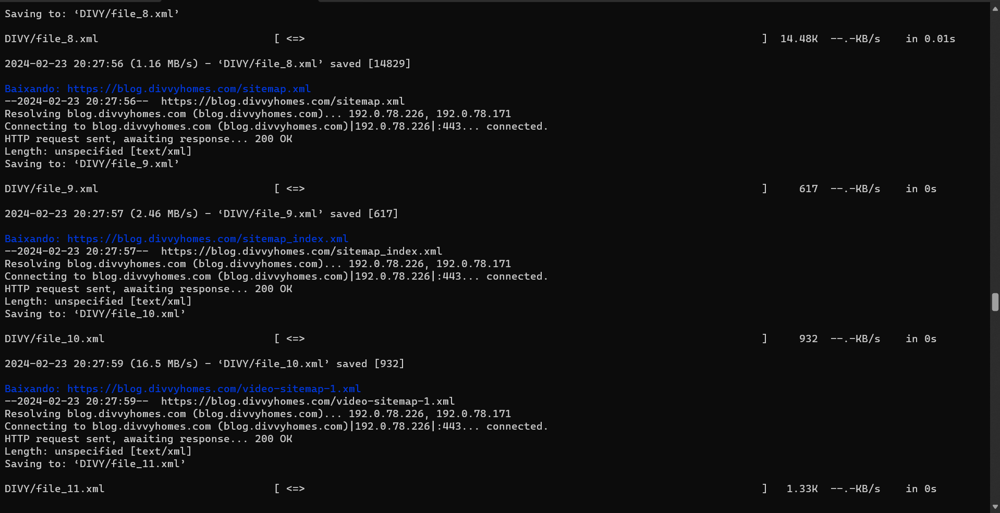
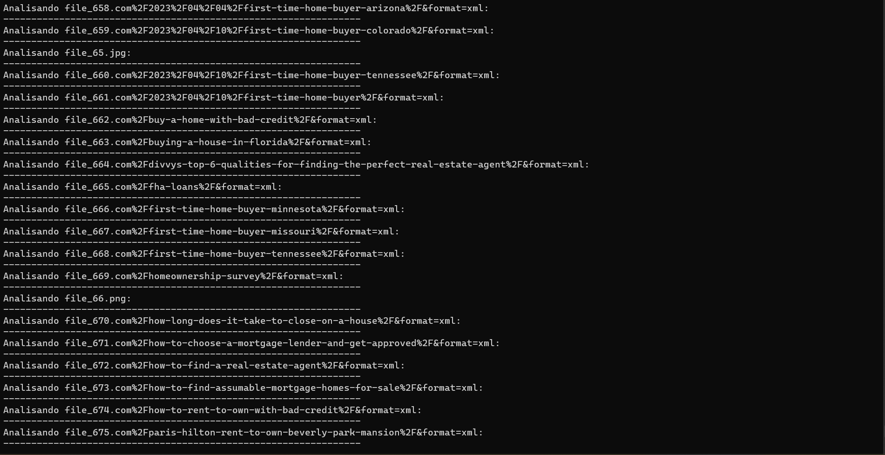
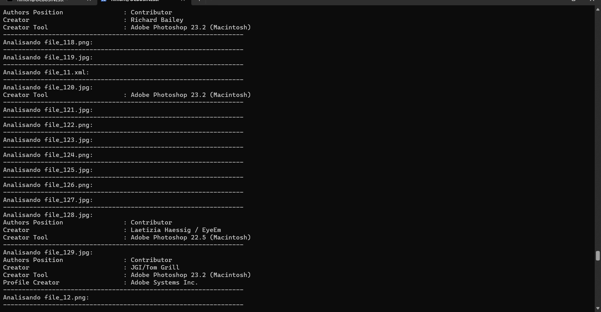

# metamore
This script uses the waybackurls tool to explore URLs in search of a variety of files, such as texts, documents, images and much more. The process is automated and without multithreading for maximum download efficiency. All downloaded files are organized in a numbered folder structure and then subjected to detailed metadata analysis to provide additional information about their content.

OBS: You can import other tools besides waybackurls

## INSTALLATION GUIDE

1 - https://github.com/himori123/metamore.git

2 - cd metamore

3 - chmod 777 metamore.sh

4 - ./metamore_5.sh

Tool output:

Tool output:

Tool output:

